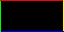
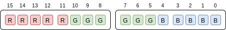

# Control Module

The control module is where the UART receive is handled, and the only component that writes to the framebuffer.

A series of commands are implemented over the UART, as outlined below.

- `R` and `r` - enable or disable the red channel
- `G` and `g` - enable or disable the green channel
- `B` and `b` - enable or disable the blue channel
- `1` through `6` - enable or disable the brightness bit
- `9` and `0` - enable and disable _all_ brightness bits
- `L` - load a framebuffer line

## Red / Green / Blue Channel Control

When working with displays, it can be incredibly useful to completely disable a channel.
For example, when working with an image or frame, you may want to ensure that the red channel is behaving correctly, but the green and or blue are so bright you can't see the red's state.

This allows you to enable and disable individual channels easily for debugging purposes.

## Brightness Bit Control

Another aspect of working with displays that can be difficult is ensuring that each bit is behaving correctly.
As an example, if you had a 6-bit gradient from left to right, it can be quite difficult to determine if the LSB is actually being stored / rendered / transmitted correctly.

Using this control means that you are able to poke out individual brightness bits, and when used in conjuntion with the RGB channel control, you can enable only a single bit at a time.

## Loading a Framebuffer Line

As this project implements a framebuffer, we need some way to fill the framebuffer with our own data.
The `L` command facilitates this, and is implemented as a multi-byte command, as follows:

- `L` - start of command
- "*row_select*" - an integer value, 0 to 31, in bits 4:0 (it's a 32-line display)
- "*pixel_data*" - a series of 128 bytes describing 64 pixels

The first 2 bytes of the payload are fairly self explanatory, the remaining 128 bytes might require a little further explanation.

As we've implemented an RGB565 framebuffer, each pixel is represented by 16-bits (2 bytes).

We can use [`border_line.png`](../res/border_line.png) and [`convert.sh`](../res/convert.sh) to help us understand the format of this command.

This image is a 64x32 pixel PNG, that has a series of 1 pixel borders:

- Top - Red
- Left - Green
- Right - Yellow
- Bottom - Blue



After running `./convert.sh border_line.png`, we are left with `border_line.mem` and `border_line.uart` - the former is for feeding into Lattice Diamond to preload the block RAM, while the latter is suitable for squirting into the FPGA at runtime.

```
00000000  4c 00 b0 00 b0 00 b0 00  b0 00 b0 00 b0 00 b0 00  |L...............|
00000010  b0 00 b0 00 b0 00 b0 00  b0 00 b0 00 b0 00 b0 00  |................|
00000020  b0 00 b0 00 b0 00 b0 00  b0 00 b0 00 b0 00 b0 00  |................|
00000030  b0 00 b0 00 b0 00 b0 00  b0 00 b0 00 b0 00 b0 00  |................|
00000040  b0 00 b0 00 b0 00 b0 00  b0 00 b0 00 b0 00 b0 00  |................|
00000050  b0 00 b0 00 b0 00 b0 00  b0 00 b0 00 b0 00 b0 00  |................|
00000060  b0 00 b0 00 b0 00 b0 00  b0 00 b0 00 b0 00 b0 00  |................|
00000070  b0 00 b0 00 b0 00 b0 00  b0 00 b0 00 b0 00 b0 00  |................|
00000080  be 00 4c 01 04 e0 00 00  00 00 00 00 00 00 00 00  |..L.............|
00000090  00 00 00 00 00 00 00 00  00 00 00 00 00 00 00 00  |................|
000000a0  00 00 00 00 00 00 00 00  00 00 00 00 00 00 00 00  |................|
000000b0  00 00 00 00 00 00 00 00  00 00 00 00 00 00 00 00  |................|
000000c0  00 00 00 00 00 00 00 00  00 00 00 00 00 00 00 00  |................|
000000d0  00 00 00 00 00 00 00 00  00 00 00 00 00 00 00 00  |................|
000000e0  00 00 00 00 00 00 00 00  00 00 00 00 00 00 00 00  |................|
000000f0  00 00 00 00 00 00 00 00  00 00 00 00 00 00 00 00  |................|
00000100  00 00 be 00 4c 02 04 e0  00 00 00 00 00 00 00 00  |....L...........|
00000110  00 00 00 00 00 00 00 00  00 00 00 00 00 00 00 00  |................|
00000120  00 00 00 00 00 00 00 00  00 00 00 00 00 00 00 00  |................|
00000130  00 00 00 00 00 00 00 00  00 00 00 00 00 00 00 00  |................|
```

What we see here is 2 and a bit lines of the framebuffer.
A line / row starts with an ASCII `L` (`0x4c`), followed by the row addresss (`0x00`, `0x01`, `0x02`, etc...), followed by pixel data.

### A Red Pixel

Inspecting `border_line.png`, and this data, we can see the the top left pixel should be red, and is being transmitted as `0xb0 0x00`. This can be expanded out into the RGB565 pixel as follows:



```
R4 R3 R2 R1  R0 G5 G4 G3    G2 G1 G0 B4  B3 B2 B1 B0
    0xb          0x0            0x0          0x0
 1  0  1  1   0  0  0  0     0  0  0  0   0  0  0  0

Red   = 0b 1 0110 = 22 ... out of 31 =  71%
Green = 0b00 0000 =  0 ... out of 63 =   0%
Blue  = 0b 0 0000 =  0 ... out of 31 =   0%
```

Interestingly the original PNG is RGB888 (24-bit), and this pixel has a red value of 255.
The discrepency here is due to the fact that we've applied gamma correction as part of the processing in `convert.sh`

### A Green Pixel

Let's now take the first pixel of line 2 - it should be green.
This pixel starts at offset 0x84 / 132 in the hexdump above.

```
R4 R3 R2 R1  R0 G5 G4 G3    G2 G1 G0 B4  B3 B2 B1 B0
    0x0          0x4            0xe          0x0
 0  0  0  0   0  1  0  0     1  1  1  0   0  0  0  0

Red   = 0b 0 0000 =  0 = out of 31 =   0%
Green = 0b10 0111 = 39 = out of 63 =  57%
Blue  = 0b 0 0000 =  0 = out of 31 =   0%
```

### A Yellow Pixel

Finally, let's look at the last pixel of line 2 - it should be yellow... i.e: Red and Green.
This pixel starts at offset 0x102 / 258 in the hexdump above.

```
R4 R3 R2 R1  R0 G5 G4 G3    G2 G1 G0 B4  B3 B2 B1 B0
    0xb          0xe            0x0          0x0
 1  0  1  1   1  1  1  0     0  0  0  0   0  0  0  0

Red   = 0b 1 0111 = 23 = out of 31 =  74%
Green = 0b11 0000 = 48 = out of 63 =  76%
Blue  = 0b 0 0000 =  0 = out of 31 =   0%
```
