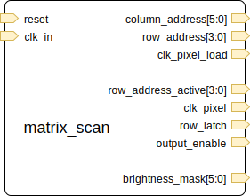

# Driving the RGB LED Matrix

This page will discuss the logical block required to drive the LED matrix - see [matrix_scan.v](../matrix_scan.v).

## Module Overview

I've implemented this as a module that has the following pins:

- Inputs
  - `reset`
  - `clk_in` - the input clock - this is used 1:1 as the pixel clock
- Outputs (Pixel Load)
  - `column_address[5:0]` - the current column being loaded
  - `row_address[3:0]` - the current row being _loaded_ (vs. being lit)
  - `clk_pixel_load` - an output clock to request the presentation of the current pixel
- Outputs (Matrix Interface)
  - `row_address_active[3:0]` - the current row that is being _lit_ (vs. being loaded)
  - `clk_pixel` - the pixel clock to the matrix
  - `row_latch`
  - `output_enable`
- Outputs (State)
  - `brightness_mask[5:0]`

Most of the I/Os are self-explanatory, however some might need a little explaining.

### `row_address` vs. `row_address_active`

As discussed right at the end of the [matrix overview](./led_matrix_overview.md#brightness-control), we can reduce off-time, and increase the frame rate by clocking pixels out while the previous state is still being lit.
To make this work properly, we need to have two different `row_address` signals - one that requests the new pixel data, and one that maintains the matrix output.

### `clk_pixel` vs. `clk_pixel_load`

The matrix will sample data on the pixel clock's rising edge, which means that we must have already presented the pixel data before this transition occurs.
To facilitate this, we present the `clk_pixel_load` one cycle earlier than the `clk_pixel`.
This gives the supporting logic advance warning (of one cycle) that pixel data needs to be presented.
