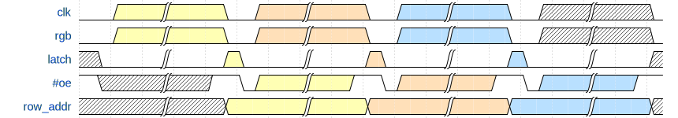

# Driving the RGB LED Matrix

This page will discuss the logical block required to drive the LED matrix - see [matrix_scan.v](../matrix_scan.v).

## Module Overview

I've implemented this as a module that has the following pins:

- Inputs
  - `reset`
  - `clk_in` - the input clock - this is used 1:1 as the pixel clock
- Outputs (Pixel Load)
  - `column_address[5:0]` - the current column being loaded
  - `row_address[3:0]` - the current row being _loaded_ (vs. being lit)
  - `clk_pixel_load` - an output clock to request the presentation of the current pixel
- Outputs (Matrix Interface)
  - `row_address_active[3:0]` - the current row that is being _lit_ (vs. being loaded)
  - `clk_pixel` - the pixel clock to the matrix
  - `row_latch`
  - `output_enable`
- Outputs (State)
  - `brightness_mask[5:0]`

Most of the I/Os are self-explanatory, however some might need a little explaining.

### `row_address` vs. `row_address_active`

As discussed right at the end of the [matrix overview](./led_matrix_overview.md#brightness-control), we can reduce off-time, and increase the frame rate by clocking pixels out while the previous state is still being lit.
To make this work properly, we need to have two different `row_address` signals - one that requests the new pixel data, and one that maintains the matrix output.

### `clk_pixel` vs. `clk_pixel_load`

The matrix will sample data on the pixel clock's rising edge, which means that we must have already presented the pixel data before this transition occurs.
To facilitate this, we present the `clk_pixel_load` one cycle earlier than the `clk_pixel`.
This gives the supporting logic advance warning (1&times; cycle) that pixel data needs to be presented.
The pixel data should not actually be presented _on_ the rising edge of `clk_pixel_load`, as it is in-phase with `clk_pixel` - instead a delay or the falling edge should be used (more on this below).

## Timing

I tried attacking this problem a few different ways before settling on a fairly simplistic approach.
Funtamentally we have a state clock which everything is derrived from - it starts the rendering of a line, and then causes the advance to the next brightness level / line.

### State Advance

The state advance (controlled by `clk_state`) will trigger the state's actions.
Once the actions are complete, the module will wait for the next rising edge of `clk_state`.

By "_actions_", I am referring to the following, which are outlined in more detail below:
  1. Enable `clk_pixel_load` for 64&times; cycles
  2. Count `63` to `0`, in phase with `clk_pixel_load` to produce `column_address[5:0]`
  3. Enable `clk_pixel` for 64&times; cycles (delayed by one cycle)
  4. Assert `row_latch` after all pixels have been clocked out
  5. Assert `output_enable` according to the 6-bit brightness levels
  6. Advance to the next brightness level / line
  6. Update `row_address_active`

To make the display look solid (and avoid flickering), we need to run `clk_state` as fast as we can.
So we allow for a full row to be clocked out, and begin the next state as immediately as possible.

This results in an overlap, where the control of certain signals are still affecting the previous row, as outlined below:

The yellow, orange, and blue sections identify which line the signal state relates to - i.e: all yellow sections relate to the same line.

As you can see, the orange line needs to be clocked out while the yellow line is still lit on the matrix.
To achieve this, we use the `row_address` for requesting data, and `row_address_active` for lighting the matrix.

### Pixel Data

As mentioned above, we have `clk_pixel` and `clk_pixel_load`, which run in phase with each other, but `clk_pixel` is delayed by one cycle.
This allows us to request data is presented in advance of it being clocked into the matrix.

Because the signals run in phase, it is inappropriate to present the pixel data _immediately_ on the rising edge, otherwise we risk corrupting the previous pixel's data as sampled by the matrix.

Luckily for us, the setup and hold times (for the TI part at least) are listed as 7 ns and 3 ns respectively.
With a 133 MHz clock, we have a cycle time of ~7.5 ns, which is more than 2&times; the hold - to improve this further, we don't actually present the data until the 3rd clock cycle (~22.5 ns).
See the framebuffer write up for more information (_coming soon_).
