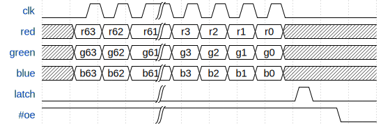
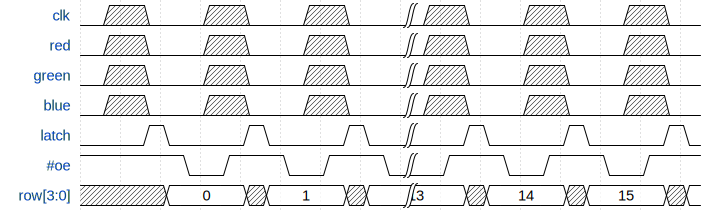
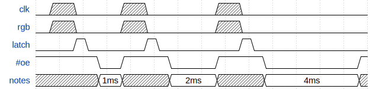

# RGB LED Matrix Module Overview

This project aims to run a 64 &times; 32 RGB LED matrix from a [TinyFPGA AX2](https://store.tinyfpga.com/products/tinyfpga-a2), with two full RGB565 framebuffers (double buffering).

## Get a Matrix

My matrix has what looks like a model number in silk on the back: `P4-256*128-2121-A2`

  - `P4` - appears to be an industry standard, I _think_ this identifies the pitch
    - In my case 4 mm between LEDs in both vertical and horizontal
  - `256*128` - is the physical dimensions of the module in millimeters
    - 256 mm &divide; 4 mm = 64 pixels
    - 128 mm &divide; 4 mm = 32 pixels
  - `2121` - I suspect is the LED package size
  - `A2` - I have no idea

The specific eBay listing for my module is [here](https://www.ebay.co.uk/itm/x/272157054443).
It _**looks**_ almost identical to the Adafruit 64 &times; 32 matrix with 4mm pitch, [here](https://www.adafruit.com/product/2278).

Due to the differenc modules available, and their slight changes (e.g: "_Up_" vs. "_Down_" arrows), I'll stick to talking about the module I have, rather than putting a caveat on everything.

## Pinout

The matrix orientation is described by "_Up_" and "_Right_" arrows.
There are two 16-pin connectors - data input on the left, and output on the right.

The pinout is as follows:

```
                +-------+
         Red 1  |  1  2 |  Green 1
        Blue 1  |  3  4 |  Ground
         Red 2  |  5  6 |  Green 2
        Blue 2     7  8 |  Ground
        Row[0]     9 10 |  Row[1]
        Row[2]  | 11 12 |  Row[3]
         Clock  | 13 14 |  Latch
#Output_Enable  | 15 16 |  Ground
                +-------+
```

From what I've seen, some modules swap `Row[3]` for another `Ground`, and others drop the second set of RGB signals...

This pinout was described by adafruit's [32x16 and 32x32 RGB LED Matrix](https://cdn-learn.adafruit.com/downloads/pdf/32x16-32x32-rgb-led-matrix.pdf) document, but I carefully confirmed it on my module.
Sadly this document doesn't outline _anything_ about how the modules work, or what signals need to do to drive them.

## Topology

My matrix uses Chinese parts, the datasheets for which are of course in Chinese or absent.

There are fundamentally only three components:

  - `74HC245` - an octal 3-state bus tranceiver
    - Can be configured in either direction or disabled (Hi-Z)
    - There are two of these that buffer the 13&times; incoming signals
  - `TC7258EN` - a 4-to-16 line decoder
    - The `Row[2:0]` inputs are decoded into 8&times; current sources (one output is high at a time)
    - Up to 3A can be sourced per pin (from minimal translation of a datasheet)
    - Pins don't sink, they go Hi-Z
    - There are four of these that split the matrix into 4 row groups, of 8 rows each
    - `Row[3]` is fed into either `ENH` or `ENL` giving control over row group that is activated
  - `DP5020B` - a 16-channel LED driver
    - Appears to be a clone of TI's TLC5926
    - Should be able to sink ~32 mA per channel (~2 A per 64 pixel row)
    - There is an external resistor to allow a configurable current limit
    - If the silk / refdes, datasheet and my interpretation of the graph are to be believed:
      - Red &rarr; ~1 k&ohm; &rarr; ~15 mA
      - Green &rarr; ~1.6 k&ohm; &rarr; ~8 mA
      - Blue &rarr; ~2.35 k&ohm; &rarr; ~6 mA
    - Data is shifted in and through a chain of 4&times;
      - All parts share `Clock`, `#Output_Enable` and `Latch`
      - Each chain gets one of the colors, e.g:
        - "_Input Connector_" &rarr; `UB1`.`SDI`
        - `UB1`.`SDO` &rarr; `UB5`.`SDI`
        - `UB5`.`SDO` &rarr; `UB9`.`SDI`
        - `UB9`.`SDO` &rarr; `UB13`.`SDI`
        - `UB13`.`SDO` &rarr; "_Output Connector_"

The matrix is constructed from two smaller 64 &times; 16 matrices, stacked one above the other.
Each of these consist of the following:

  - 4&times; `DP5020B` in a chain for Red, totalling 64 pixels in width (and 64-bits)
  - 4&times; `DP5020B` in a chain for Green
  - 4&times; `DP5020B` in a chain for Blue
  - 1&times; `TC7258EN` with `Vcc` &rarr; `ENH`, and `Row[3]` &rarr; `ENL` (activates only when `Row[3]` is Low)
  - 1&times; `TC7258EN` with `Row[3]` &rarr; `ENH`, and `GND` &rarr; `ENL` (activates only when `Row[3]` is High)

## Operation

### One Line

To drive the matrix, you need to:

  1. Clock in a row's worth of pixels - data is sampled on the clock's rising edge
  2. Assert the latch - shift register is clocked into the output on the latch's rising edge
  3. Address a row (0 - 15)
  4. Enable the output



This will let you display 6 colors on a single row of the matrix (well... two rows, due to the two stacked sub-modules)

**NOTE:** I've found that if you don't keep the average current down, then you might see a _very_ bright flash, followed by a dark matrix.
I'm not 100% sure, but I suspect that this is related to the "_Integrated anti-burnout power tube with overcurrent and short circuit protection._" (thanks Google Translate).
I've had no problems if you keep scanning the matrix, or PWM the output enable.

### Whole Matrix

To drive the whole matrix, you'll need to clock out a row, one-by-one.
In this simple form, you'll get 3-bit color (i.e: Black, Red, Green, Blue, Yellow, Cyan, Magenta, White).

As shown below, you _must_ be careful of a few transitions:

  - Only assert the latch when the output is off (or you're happy for the update to be presented "_now_")
  - Only change the `Row` when the output is off (otherwise you'll get "_glitches_", as demonstrated [here](https://www.youtube.com/watch?v=tG1vObOIVQ4))
  - It's fine to clock new data in while the output is still active



### Brightness Control

As we aren't able to address pixels individually, and the drivers don't provide any brightness control (just on/off), we must control the output enable ourselves.

The best way to do this is by displaying one bit of the sub-pixel's brightness at a time.

  - I'm aiming at RGB565, therefore I _need_ 6-bit brightness control
  - Vary the `#Output_Enable` width
  - Use a rolling single-bit mask, and multiple row shifts to use the correct brightness

The width of `#Output_Enable` needs to be related to the current bit's value...

  - Mask of `6'b000001` has a width of 1&times;
  - `6'b000010` &rarr; 2&times;
  - `6'b000100` &rarr; 4&times;
  - `6'b001000` &rarr; 8&times;
  - `6'b010000` &rarr; 16&times;
  - `6'b100000` &rarr; 32&times;

The apparent brightness of LEDs does not correlate linearly with average current (i.e: on-time).
For low values the brightness rapidly increases, while for high values the brightness appears to barely change.
To address this, we can apply [Gamma correction](https://en.wikipedia.org/wiki/Gamma_correction).
I'm wondering if we can do something about that here, with the variable width control of `#Output_Enable`... but brief attempts and mental reasoning are hinting at "_no_"... any thoughts? :-)



To reduce off-time (i.e: make the display brighter), you can start clocking the next bit out during the on-time of the previous bit.
