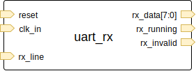
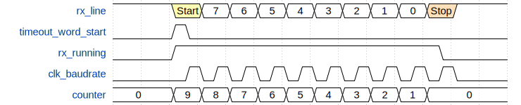

# UART Rx

This page will discuss the logical block required to receive UART frames - see [uart_rx.v](../uart_rx.v).

## Module Overview

I've implemented this as a module that has the following pins:

- Inputs
  - `reset`
  - `clk_in` - the clock input - this is divided by the `CLK_DIV_COUNT` parameter
  - `rx_line` - the UART receive pin
- Outputs
  - `rx_data` - the received data frame's payload - `DATA_COUNT` bits wide
  - `rx_running` - high while a receive is in progress, trigger external logic on the falling edge
  - `rx_invalid` - indicates when `rx_data` is not valid

## Timing

Internally this module produces a clock at the baudrate that is gated until the start bit is received - `clk_baudrate`.

`clk_baudrate` gives us a rising edge at approximately the midpoint of each bit on the line.
On this rising edge, we shift one bit into the `rx_bitstream` register.

Using the falling edge of `clk_baudrate`, we advance the counter by one (`~clk_baudrate` is fed into the `timeout` module).
The counter's initial value is `DATASTOP_COUNT`, which is `DATA_COUNT + STOP_COUNT`... i.e: for 8-bit data with 1 stop bit, `DATASTOP_COUNT = 9`.

Once the timeout reaches zero, `rx_running` returns low, and `clk_baudrate` is gated again.

## Usage

To use this module, you need to provide `clk_in` with a suitable value in `CLK_DIV_WIDTH`, and `rx_line`.

Each time `rx_running` returns low, you should inspect `rx_invalid` and `rx_data`.
